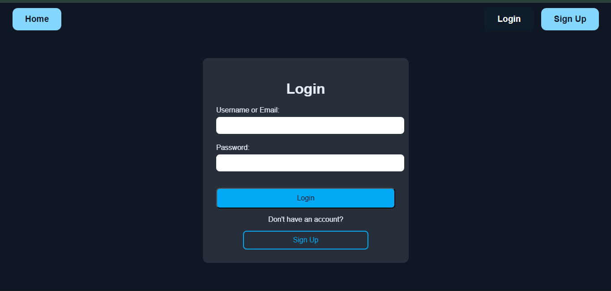
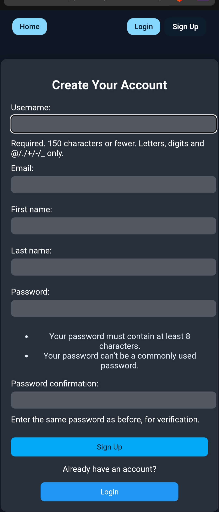
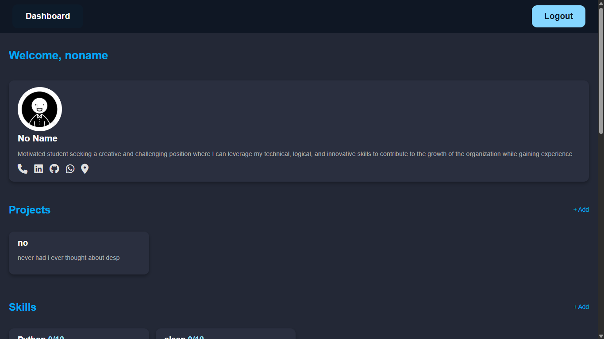
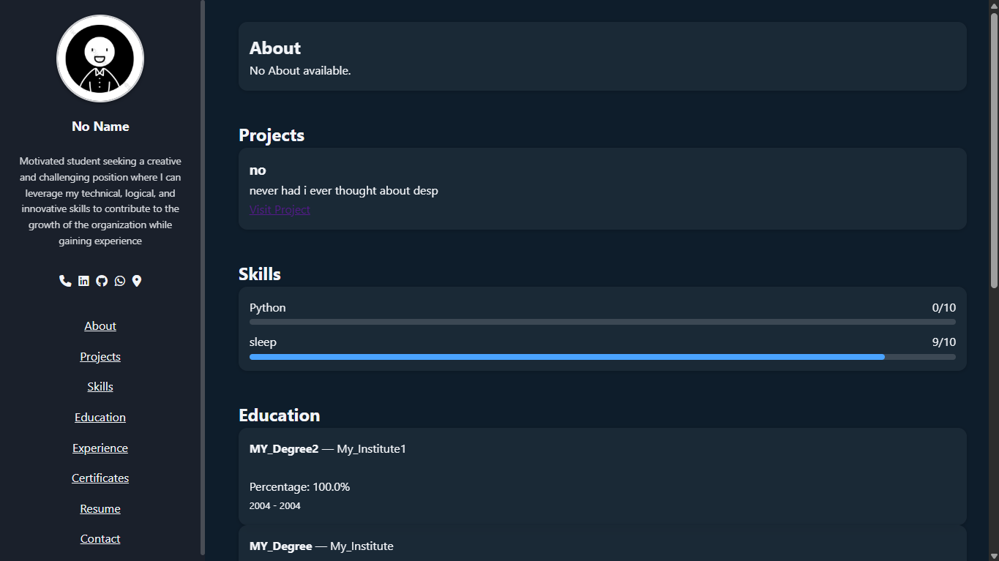

# 🌐 Portfolio Maker

A modern **Django web app** that lets users easily **create, customize, and share** their online portfolios.  
Users can register, verify their email via OTP, and showcase their **skills, education, and projects** using beautiful templates.

---

## 🚀 Live Demo

🔗 **[Try it here → Portfolio Maker (PythonAnywhere)](https://santcoder20.pythonanywhere.com/)**

---

## 🖥️ Features

✅ User authentication (Sign Up, Login, Logout)  
✅ OTP-based email verification  
✅ Profile creation and editing  
✅ Education, skills, and project management  
✅ Responsive and elegant UI  
✅ Dark blue themed interface  
✅ Dynamic portfolio page with custom styling  

---

## 🧩 GUI Preview

> *(Add screenshots here once you take them — e.g., `/static/images/screens/login.png`)*

| Page | Screenshot |
|------|-------------|
| **Login Page** |  |
| **Sign Up Page** |  |
| **Dashboard** |  |
| **Portfolio View** |  |

---

## 🗂️ Project Structure

```
PortfolioMaker/
│
├── accounts/                 # Handles authentication and profile features
│   ├── models.py
│   ├── views.py
│   ├── urls.py
│   └── templates/accounts/
│
├── users/                    # User dashboard and portfolio editing
│   ├── models.py
│   ├── views.py
│   ├── urls.py
│   └── templates/users/
│
├── static/                   # CSS, JS, images
│   ├── css/
│   ├── js/
│   └── images/
│
├── templates/                # Base templates
│   ├── base.html
│   └── includes/
│
├── PortfolioMaker/           # Core Django settings
│   ├── settings.py
│   ├── urls.py
│   ├── asgi.py
│   └── wsgi.py
│
├── db.sqlite3                # Default local database
├── manage.py
└── requirements.txt
```

---

## ⚙️ Installation & Setup (Local)

Follow these steps to run the project locally:

### 1️⃣ Clone or Download

```bash
git clone https://github.com/yourusername/portfolio-maker.git
cd portfolio-maker
```

### 2️⃣ Create Virtual Environment

```bash
python -m venv venv
venv\Scripts\activate       # On Windows
source venv/bin/activate    # On Mac/Linux
```

### 3️⃣ Install Dependencies

```bash
pip install -r requirements.txt
```

### 4️⃣ Apply Migrations

```bash
python manage.py makemigrations
python manage.py migrate
```

### 5️⃣ Create Superuser (optional)

```bash
python manage.py createsuperuser
```

### 6️⃣ Run Server

```bash
python manage.py runserver
```

Now open your browser and go to 👉 **http://127.0.0.1:8000/**

---

## 🔑 Environment Variables

Make sure to configure the following in your `.env` or settings:

```env
SECRET_KEY=your_django_secret_key
DEBUG=True
EMAIL_HOST=smtp.gmail.com
EMAIL_PORT=587
EMAIL_HOST_USER=youremail@gmail.com
EMAIL_HOST_PASSWORD=yourpassword
EMAIL_USE_TLS=True
```

---

## ☁️ Deployment

This project is deployed on **PythonAnywhere**:  
🔗 https://santcoder20.pythonanywhere.com/

For your own deployment:
1. Create a PythonAnywhere account.  
2. Upload your project files.  
3. Set up a virtual environment.
4. Change setting.py to allow host and add email details in end
5. Configure WSGI and static files.  
6. Run migrations and restart the web app.

---

## 🧠 Tech Stack

- **Backend:** Django 5.x  
- **Frontend:** HTML5, CSS3, JavaScript  
- **Database:** SQLite (local) / MySQL (production)  
- **Hosting:** PythonAnywhere  
- **Version Control:** Git & GitHub  

---

## 📸 Upcoming Enhancements

- Custom portfolio templates  
- Image uploads for projects  
- Live theme switcher  
- Downloadable portfolio as PDF  

---

## 🤝 Contributing

1. Fork the repository  
2. Create your feature branch (`git checkout -b feature/awesome-feature`)  
3. Commit changes (`git commit -m "Added awesome feature"`)  
4. Push to branch (`git push origin feature/awesome-feature`)  
5. Open a Pull Request 🎉  

---

## 🧾 License

This project is licensed under the **MIT License** — feel free to use and modify.

---

### 💙 Developed by [SantCoder20](https://santcoder20.pythonanywhere.com/)
> “Build your online presence with style.”
